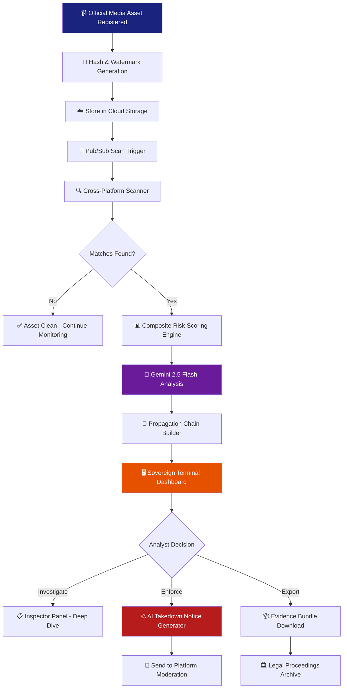
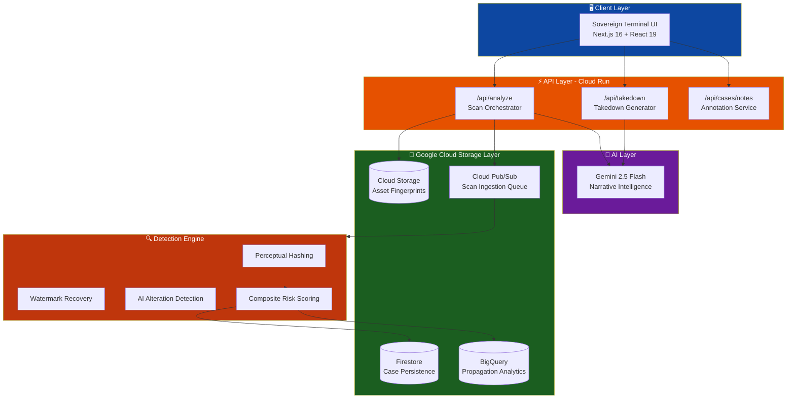

<p align="center">
  
  
  
  
</p>

<h1 align="center">🛡️ LeakMap AI</h1>
<h3 align="center">Enterprise-Grade Digital Media Protection Platform</h3>
<p align="center"><i>Identify. Track. Flag. Enforce.</i></p>

---

## 📌 Links

| Resource | URL |
|----------|-----|
| 🔗 **GitHub Repository** | [github.com/let-the-dreamers-rise/leakmap-ai](https://github.com/let-the-dreamers-rise/leakmap-ai) |
| 🚀 **Live MVP** | [leakmap-ai-1064925691979.us-central1.run.app](https://leakmap-ai-1064925691979.us-central1.run.app) |
| 🎬 **Demo Video (3 min)** | *[To be added after recording]* |

---

## 📋 Brief About the Solution

**LeakMap AI** is a cloud-native, AI-powered control plane purpose-built for **protecting the integrity of digital sports media**. It enables Trust & Safety analysts, broadcast rights operations teams, and legal escalation teams to:

1. **Authenticate** official media assets using perceptual hashing, watermark signatures, and cryptographic fingerprints
2. **Detect** unauthorized redistribution across fragmented platforms (Telegram, TikTok, Reddit, X) in near real-time
3. **Attribute** the leak origin through propagation chain analysis
4. **Enforce** rights with AI-generated, legally-sound DMCA takedown notices powered by **Google Gemini 2.5 Flash**

In the modern sports broadcasting ecosystem, exclusive media rights are worth billions — yet a single highlight clip can be ripped, remixed, and redistributed across the internet within seconds. Manual monitoring is impossible at scale. LeakMap AI automates the entire detection-to-enforcement pipeline.

---

## 💡 Opportunities & Differentiation

### a) How is it different from existing ideas?

| Existing Solutions | LeakMap AI |
|---|---|
| **YouTube Content ID** — works only within YouTube's walled garden | Works **cross-platform** across Telegram, TikTok, Reddit, X, and more |
| **Audible Magic / Pex** — audio-only fingerprinting | **Multi-signal fusion**: perceptual hashing + watermark recovery + AI-alteration detection |
| **Manual DMCA filing** — slow, expensive, lawyer-dependent | **Gemini-powered automated takedown drafts** generated in seconds |
| **Hash-based detection** — easily defeated by cropping/re-encoding | **AI-resistant scoring** that detects modifications like voiceovers, crops, speed changes |
| **Fragmented dashboards** — separate tools for detection, analysis, legal | **Unified operator workspace** — detect, analyze, attribute, and enforce in one terminal |

### b) How does it solve the problem?

LeakMap AI implements the **full protection loop** required by the challenge theme:

```
Register Asset → Scan Platforms → Score Threats → Trace Origin → Generate Takedown → Export Evidence
```

1. **Registration**: Official assets are ingested with metadata (rights owner, event, usage policy) and hashed for reference
2. **Detection**: Asynchronous scanning via Pub/Sub searches fragmented platforms for matching content
3. **Scoring**: Each suspect gets a **Composite Risk Score** combining fingerprint match, watermark recovery, velocity, and reach
4. **Attribution**: Propagation chain analysis identifies the likely leak origin (e.g., a specific broadcast partner relay)
5. **Enforcement**: Gemini 2.5 Flash synthesizes case metadata into legally-formatted DMCA takedown notices
6. **Evidence**: Full case data is exportable as a cryptographic evidence bundle for legal proceedings

### c) USP of the Proposed Solution

> **"From detection to legal enforcement in a single click."**

- **Only platform** that combines cross-platform detection + AI attribution + automated legal enforcement in one interface
- **Gemini-native**: Uses Google's most advanced AI model for narrative intelligence and legal guardrail analysis
- **Operator-first UX**: High-density "Sovereign Terminal" design inspired by Bloomberg/Palantir — built for speed, not aesthetics alone
- **Cloud-native scalability**: Deployed on Google Cloud Run with Firestore, BigQuery, Cloud Storage, and Pub/Sub

---

## ✨ Features

| Feature | Description |
|---------|-------------|
| 🔍 **Multi-Signal Threat Detection** | Combines perceptual fingerprinting, watermark recovery, and AI-alteration detection to score suspects |
| 📊 **Composite Risk Scoring** | Each threat gets a weighted score (0-100%) factoring in fingerprint match, watermark integrity, velocity, and reach |
| 🌐 **Cross-Platform Scanning** | Monitors Telegram, TikTok, Reddit, X, and other platforms for unauthorized redistribution |
| 🔗 **Propagation Chain Analysis** | Traces the leak path from broadcast origin through distribution relays to final public exposure |
| 🤖 **Gemini AI Takedown Generator** | One-click DMCA takedown notice generation powered by Gemini 2.5 Flash with legal guardrails |
| 📦 **Evidence Bundle Export** | Exports full case data (metrics, suspects, propagation, notes) as a JSON evidence pack |
| 🖥️ **Sovereign Terminal UI** | High-density 3-column operator workspace with real-time threat metrics and analyst tools |
| 📱 **Responsive Mobile Terminal** | Full 5-tab mobile layout for on-the-go critical alert response |
| 📝 **Analyst Notes System** | Persistent case annotation system for collaborative investigation workflows |
| 🔄 **Real-time Metrics Dashboard** | Live leak window, mean confidence, and critical match counters in the command header |

---

## 🔄 Process Flow Diagram



---

## 🏗️ Architecture Diagram



---

## 🛠️ Technologies Used

| Layer | Technology | Purpose |
|-------|-----------|---------|
| **Frontend** | Next.js 16, React 19, TypeScript | Server-rendered operator terminal UI |
| **Styling** | Tailwind CSS 4, Custom Design Tokens | Sovereign Terminal design system |
| **AI Model** | Gemini 2.5 Flash (`@google/genai`) | Narrative intelligence, takedown generation, legal guardrail analysis |
| **Compute** | Google Cloud Run | Serverless container deployment with auto-scaling |
| **Database** | Google Cloud Firestore | Real-time case persistence and analyst notes |
| **Object Storage** | Google Cloud Storage | Asset fingerprint and watermark reference storage |
| **Analytics** | Google BigQuery | Propagation log analytics and historical trend analysis |
| **Messaging** | Google Cloud Pub/Sub | Asynchronous scan ingestion pipeline |
| **Fonts** | IBM Plex Mono, Inter | Operator-grade monospace + UI typography |
| **Icons** | Lucide React | Minimal, consistent iconography |

---

## 💰 Estimated Implementation Cost

| Resource | Monthly Cost (Estimated) |
|----------|-------------------------|
| Cloud Run (2 vCPU, 512MB) | ~$15/mo (pay-per-request) |
| Gemini 2.5 Flash API | ~$5/mo (low-volume demo) |
| Firestore (1GB storage) | ~$0.18/mo |
| Cloud Storage (5GB) | ~$0.10/mo |
| BigQuery (10GB processed) | ~$0.05/mo |
| Pub/Sub (10K messages) | ~$0.04/mo |
| **Total** | **~$20/mo for MVP scale** |

> 💡 At enterprise scale (100K+ scans/day), estimated cost scales to ~$200-500/mo with Cloud Run auto-scaling.

---

## 📸 MVP Snapshots

### Sovereign Terminal — Full Desktop Layout
The 3-column operator workspace showing the Case Intake rail, Threat Intelligence center, and Inspector panel simultaneously.

### Threat Intelligence Table
High-density data table with Composite Risk Scores, platform badges, velocity metrics, and one-click suspect inspection.

### AI-Powered Takedown Generator
Gemini 2.5 Flash generates legally-formatted DMCA takedown notices from case metadata in a single click.

### Evidence Bundle Export
Full case data exported as a structured JSON evidence pack for legal proceedings and compliance archives.

### Mobile Responsive Terminal
5-tab mobile layout enabling on-the-go critical alert response with full feature parity.

---

## 🔮 Future Development

| Phase | Feature | Timeline |
|-------|---------|----------|
| **v1.1** | Live platform API integrations (Telegram Bot API, TikTok Research API) | Q3 2026 |
| **v1.2** | Real-time WebSocket push notifications for critical leak alerts | Q3 2026 |
| **v1.3** | Multi-tenant RBAC with Google Identity Platform | Q4 2026 |
| **v2.0** | Computer Vision pipeline for frame-level video fingerprinting | Q4 2026 |
| **v2.1** | Blockchain-anchored evidence timestamping for court admissibility | Q1 2027 |
| **v2.2** | Automated platform-specific takedown API submission (YouTube, Meta, X) | Q1 2027 |
| **v3.0** | Predictive leak modeling — flag high-risk assets before broadcast | Q2 2027 |

---

## 🚀 Local Development

```bash
# Clone the repository
git clone https://github.com/let-the-dreamers-rise/leakmap-ai.git
cd leakmap-ai

# Install dependencies
npm install

# Configure environment
cp .env.example .env.local
# Set GEMINI_API_KEY in .env.local

# Run development server
npm run dev
```

Open [http://localhost:3000](http://localhost:3000) to access the Sovereign Terminal.

## 🌐 Deployment

The application is deployed on **Google Cloud Run** with a standalone Next.js output:

```bash
gcloud run deploy leakmap-ai \
  --source=. \
  --project=leakmap-ai-2026 \
  --region=us-central1 \
  --allow-unauthenticated \
  --set-env-vars="GEMINI_API_KEY=<your-key>"
```

---

## 👥 Team

**Let The Dreamers Rise**

---

<p align="center">
  <b>Built with ❤️ for the Google Solution Challenge 2026</b><br/>
  <i>Protecting the future of digital sports media</i>
</p>
